 

##  What it does

Windows already has a package manager, a disk cleaner, a repair toolkit and a pile of
third-party utilities — they just live in different windows, different elevation prompts
and different websites. This app puts the ones you actually use in one place.

Open it, pick a job from the sidebar, walk away. Install a catalog of apps through
winget, get patched software, clean and repair the system, activate Windows, launch Sparkle or WinUtil, theme Spotify, or
restart straight into BIOS. An account is optional: sign in only if you want those
preferences on another PC.

##  Features

### App & software installers

- Categorized **winget catalog** — browsers, communication, games, media, development,
  security, hardware, utilities, plus your own custom entries.
- **Crack Apps** — Download and install patched versions of professional software on-demand.
- **Check Installed** scans what is already on the machine and what can be upgraded.
- Bulk actions: install selected, uncheck all, export and import lists, upgrade all.
- List or grid view, sorted by category, A→Z, Z→A or status.

### System cleaner & maintenance

- **System Cleaner:** Scan and remove temporary files, Prefetch, Recycle Bin, Windows Update cache,
  thumbnail cache, and error reports to free up disk space.
- **Network:** Flush DNS, release/renew IP, fix Bluetooth, full network reset.
- **Repair:** SFC, DISM, Check Disk, restart audio services, Winget upgrade all.

### Windows tools & utilities

- **Activate & Auto Login** — Activate Windows/Office and set up automatic login.
- **Debloat** — Downloads and launches the open-source Sparkle utility on first use.
- **Windows Utility** — Chris Titus Tech's WinUtil, run elevated from the official signed script.
- **BIOS / UEFI** — One click to restart into firmware setup (admin required).
- **Spicetify** — Install, uninstall, or fully remove Spotify + Spicetify.

### Quality of life

- Dark UI with a custom Windows 11-style title bar.
- Optional **Google or Discord** sign-in via Supabase Auth to sync theme, language,
  and preferences.
- Background **auto-updates** from Cloudflare R2, including portable builds.
- Authenticode-signed installers, so SmartScreen shows a trusted publisher.

###  Languages

English and Greek. Switch from Settings; the rest of the app follows immediately.

##  Install

**Requirements:** Windows 10/11 (64-bit) · 4 GB RAM · 200 MB storage.

1. Download the [installer](https://downloads.thomast.uk/MakeYourLifeEasier-installer.exe)
   or the [portable build](https://downloads.thomast.uk/MakeYourLifeEasier-Portable.exe).
2. Run it. The installer is Authenticode-signed as **ThomasThanos**.
3. (Optional) Sign in with Google or Discord if you want settings to follow you.
4. **Use the sidebar** to navigate between tools:
   - **Apps:** Install Apps, Crack Apps
   - **System:** System Cleaner, System Maintenance
   - **Activation:** Activate & Auto Login
   - **Utilities:** BIOS, Spicetify, Christitus, Debloat

> **Some tools need administrator rights.** Cleanup of protected folders, SFC/DISM,
> BIOS restart, Sparkle and WinUtil will prompt UAC. The rest of the app works without
> elevation.

##  Settings

Reachable from the sidebar → **Settings**. Changes save instantly, locally first.

| Group | Settings |
|---|---|
| **Appearance** | Language (English / Greek) · sidebar expanded/collapsed · installer list/grid · maintenance layout |
| **Account** | Google or Discord sign-in · synced preferences · reset synced settings · sign out |
| **Updates** | Check for updates · progress UI for installer and portable |

The app is fully usable signed out. An account only adds cross-device sync of
preferences — never of files, credentials or system state.

##  What it asks of Windows

| Access | Why it is needed |
|---|---|
| **Local files** | Settings JSON, encrypted session cache, downloaded tools (Sparkle, crack installers, 7-Zip helpers). |
| **Administrator (on demand)** | Cleanup of protected paths, SFC/DISM/Check Disk, BIOS restart, Sparkle, WinUtil. |
| **Network** | winget catalogs, optional auth/sync, auto-update feed on `downloads.thomast.uk`, first-run tool downloads. |
| **Electron `safeStorage`** | Encrypts the local auth/session cache with the OS credential store when available. |

That is the complete list. No telemetry, no ads, no always-on cloud.

##  Privacy, briefly

**The tools run on your computer.** Maintenance, the installer hub, debloat and
utility launches never leave the machine. Optional account sync stores only
preferences (theme, language, selected app list, view/sort) through Supabase Auth.
Session cache is encrypted at rest. The renderer is locked down: strict CSP, no
inline scripts, context isolation via a dedicated preload bridge.

No analytics. No ads. Signed-out is the default.

##  Troubleshooting

<b>SmartScreen or Windows Defender warns on first run</b>

 

The publisher is **ThomasThanos**. New certificates take time to build reputation;
the installer is still Authenticode-signed. Prefer the installer over an unsigned
copy from elsewhere.

<b>winget is not installed / Check Installed does nothing</b>

 

App Installer (winget) has to be present. Use **Open Microsoft Store** from the
installer page, install *App Installer*, then try again.

<b>A cleanup or repair task asks for admin and then seems stuck</b>

 

Approve the UAC prompt. Only one maintenance task runs at a time; wait for it to
finish before starting another. Limited scans without admin skip protected folders
until you elevate.

<b>Settings did not appear on another PC after sign-in</b>

 

Sync is preferences only, and it needs a configured OAuth client. Sign out and
back in once. If the login button says credentials are missing, you are on a build
without cloud auth — local settings still work.

<b>Updates never show up</b>

 

Packaged builds check `https://downloads.thomast.uk`. Portable mode updates too; leave the app open
long enough for the background check.

##  Licence

Source-available, all rights reserved. The source is published for viewing and
education. Compiled binaries may be used for personal, non-commercial use.
Copying, modifying, redistributing or using the software commercially requires
written permission.

**ThomasThanos** · [GitHub](https://github.com/thomasthanos) ·
[thomasthanos28@gmail.com](mailto:thomasthanos28@gmail.com)
