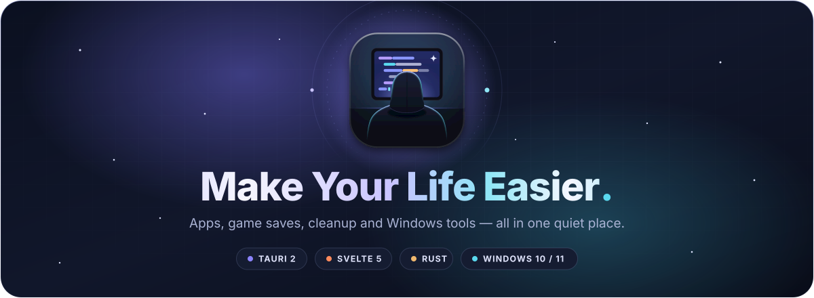
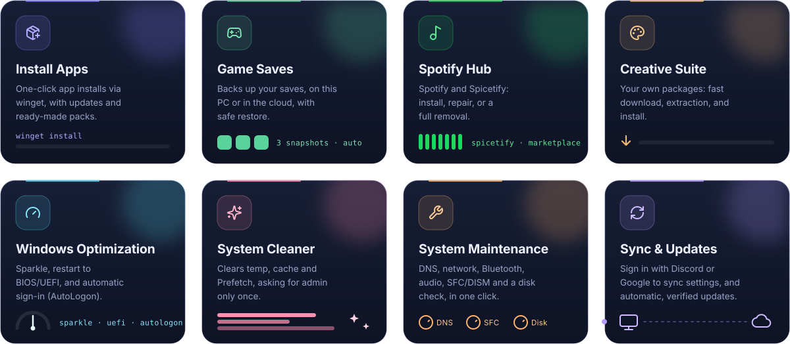
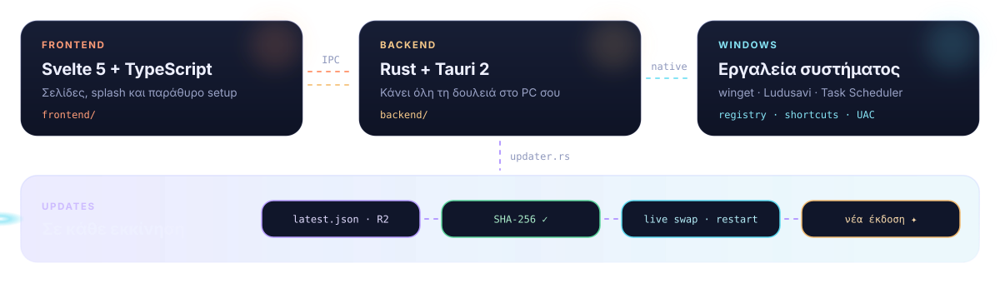

<p align="center">
  
</p>

<p align="center">
  <a href="https://github.com/thomasthanos/Make_Your_Life_Easier.A.E/releases/latest"></a>
  <a href="https://github.com/thomasthanos/Make_Your_Life_Easier.A.E/actions/workflows/ci.yml"></a>
  
</p>

<p align="center">
  <a href="https://downloads.thomast.uk/MakeYourLifeEasier-installer.exe"></a>
</p>

<p align="center">
  <sub><a href="https://github.com/thomasthanos/Make_Your_Life_Easier.A.E/releases/latest">All releases</a> &nbsp;·&nbsp; <a href="docs/DEVELOPMENT.md">For developers</a> &nbsp;·&nbsp; <a href="LICENSE">License</a></sub>
</p>


<h2 align="center">What's inside</h2>

<p align="center">
  
</p>

<h2 align="center">Install</h2>

<p align="center">
  
</p>

<p align="center"><sub>If the WebView2 Runtime is missing, the setup installs it from Microsoft. Your settings and data are kept across every update.</sub></p>

<h2 align="center">How it works</h2>

<p align="center">
  
</p>


## For developers

```powershell
npm install
npm run dev      # the app with hot reload
npm run build    # installer → backend/target/release/bundle/setup/MakeYourLifeEasier.exe
```

You'll need Node.js 20+, Rust (MSVC), and the Visual Studio Build Tools. Structure, pages, updater and setup: [docs/DEVELOPMENT.md](docs/DEVELOPMENT.md).

## License

A proprietary project by **ThomasThanos**. You're free to use the official, unmodified builds for personal use. Copying, modifying, or redistributing the code needs written permission. Full terms in [LICENSE](LICENSE).

<br />

<p align="center">
  <br />
  <sub>Made with ☕ by <a href="https://github.com/thomasthanos">ThomasThanos</a></sub>
</p>
